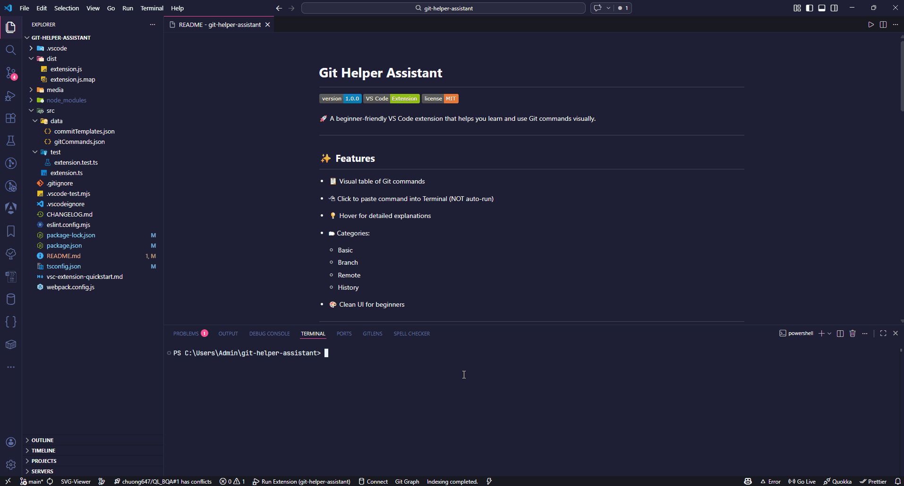

# Git Helper Assistant


🚀 A beginner-friendly VS Code extension that helps you learn and use Git commands visually.

---

## ✨ Features

* 📋 Visual table of Git commands
* 🖱 Click to paste command into Terminal (NOT auto-run)
* 💡 Hover for detailed explanations
* 🗂 Categories:

  * Basic
  * Branch
  * Remote
  * History
* 🎨 Clean UI for beginners

---

## 🎬 Demo

> 👉 Add your GIF here later (record using ScreenToGif or OBS)



---

## ⚡ Quick Start (Dev)

```bash
npm install
npm run compile
code .
```

👉 Press **F5** in VS Code to run extension

---

## 🚀 How to Use

1. `Ctrl + Shift + P`
2. Type: `Git Helper Assistant: Open`
3. Click a command → paste into Terminal
4. Edit → Enter

---

## 📦 Installation

### From Marketplace

1. Open VS Code
2. Go to Extensions (`Ctrl + Shift + X`)
3. Search: **Git Helper Assistant**
4. Click Install

---

## 🛠 Tech Stack

* TypeScript
* Webpack
* VS Code API

---

## 🧑‍🎓 About

Built to help Git beginners learn commands in a safe and visual way.

---

## 📝 Release Notes

### 1.0.0

* Initial release
* Git command table
* Hover guide
* Click to paste

---

## 🤝 Contributing

Pull requests are welcome ❤️

---

## 📄 License

MIT

